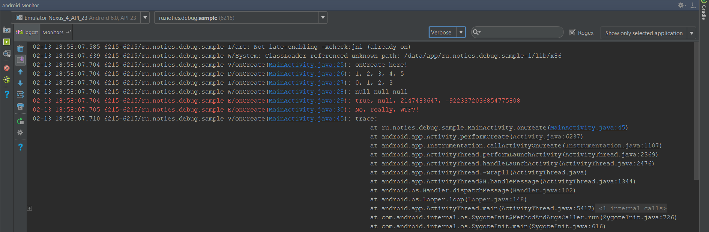
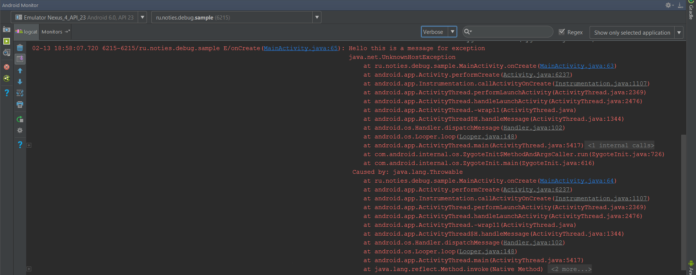
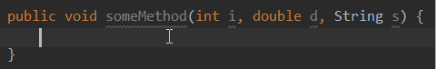

# Debug
[](https://android-arsenal.com/details/1/1038)
[](http://search.maven.org/#search|ga|1|g%3A%22ru.noties%22%20AND%20a%3A%22debug%22)
[](http://search.maven.org/#search|ga|1|g%3A%22ru.noties%22%20AND%20a%3A%22debug-remove%22)

Fast, easy and poweful logging utility for Android and Java.
* Automatic tags based on Java class and method name, easy navigation to that call from IDE console output.
* Build-in string formatting
* Customizable outputs ready for extension (console, file, network, etc)
* Easy method chain tracing (current method calls chain that triggered execution), navigatable from IDE console output
* Processor to actually **remove** all logging calls (not suppress, but modify Java AST to remove all calls from source code)


All links are clickable and clicking on them will navigate to the referenced method in an IDE:







Quick peek on live templates:




## Installation
In your `dependencies` block in `build.gradle`:
```gradle
// the core library
compile 'ru.noties:debug:3.0.0@jar'

// annotation processor to remove all logging calls
annotationProcessor 'ru.noties:debug-remove:3.0.0'
```


To start using this library it must be initialized with desired output:
```java
Debug.init(new AndroidLogDebugOutput(/*isDebug*/true)); // BuildConfig.DEBUG can be used
```
`Debug.init()` takes an array or a Collection of outputs.
```java
Debug.init(new AndroidLogDebugOutput(true), new SystemOutDebugOutput(true));

final List<DebugOutput> outputs = /*obtain desired outputs)*/;
Debug.init(outputs);
```


In order to use processor, that removes all `Debug.*` calls you must annotate any class in your project with `@ru.noties.debug.DebugRemove` (Your application class is a wise choice):
```java
@DebugRemove
public class MyApplication extends android.app.Application {}
```

`DebugRemove` takes optional boolean value that indicates if processor must actually modify source code
```java
@DebugRemove(true); // default value is `true`, so `@DebugRemove` can be used
@DebugRemove(false);
```


Unfortunatelly one cannot use `BuildConfig.DEBUG` value as it's not a compile time constant (`Boolean.parseBoolean("true");`). In case of Android one can add this simple property to each buildType:
```gradle
android {

    /* rest of the closure is omitted for brevity */

    buildTypes {

        release {
            buildConfigField 'boolean', 'REMOVE_DEBUG_LOGS', 'true'
        }

        debug {
            buildConfigField 'boolean', 'REMOVE_DEBUG_LOGS', 'false'
        }
    }
}
```


And then can be used:
```java
@DebugRemove(BuildConfig.REMOVE_DEBUG_LOGS)
public class MyApplication extends android.app.Application {}
```


If proguard is used this configuration can be used to remove all the log calls (instead of using processor):
```proguard
-assumenosideeffects class ru.noties.debug.Debug {
    public static *** v(...);
    public static *** d(...);
    public static *** i(...);
    public static *** w(...);
    public static *** e(...);
    public static *** wtf(...);
    public static *** trace(...);
    public static *** init(...);
}
```


## Usage
### Logs
Debug has all the default Android log levels: **VERBOSE**, **DEBUG**, **INFO**, **WARN**, **ERROR**, **WTF**. Each level has corresponding Debug method:
```java
Debug.v();
Debug.d();
Debug.i();
Debug.w();
Debug.e();
Debug.wtf();
```

All methods take optional `Throwable` and `Object...`
```java
int value = -1;
try {
    value = /* obtrain value */;
    Debug.i("obtained value: %d", value);
} catch (Throwable throwable) {
    Debug.e(throwable);
    Debug.w(throwable, "Exception executing try code block... value: %d", value);
}
```

If first argument is a String that has valid `String.format` modifiers, than `String.format` will be used with first argument as a pattern and all the rest arguments as `String.format` arguments
```java
Debug.i("%1$d + %1$d = %2$d", 2, (2 + 2)); // -> "2 + 2 = 4"
Debug.i(throwable, "%1$d + %1$d = %2$d", 2, (2 + 2)); // -> "2 + 2 = 4" + throwable stacktrace
```

Else all arguments will be concatted into one string:
```java
Debug.i("first", 2, true, "forth", null); // -> "first, 2, true, forth, null"
```


### Trace
Will print method chain calls that triggered with log call
```java
Debug.trace();
Debug.trace(int maxStack);
Debug.trace(Level level);
Debug.trace(Level level, int maxStack);
```


## Live templates (IDEA)
There is a file with basic templates: [templates_ru_noties_debug.xml](templates_ru_noties_debug.xml).

[Learn how to add custom live templates to a IDEA IDE](https://www.jetbrains.com/help/idea/2016.3/live-templates.html)

The shortkeys are:
```
dv [tab] -> Debug.v();
dd [tab] -> Debug.d();
di [tab] -> Debug.i();
dw [tab] -> Debug.w();
de [tab] -> Debug.e();
```

There are also shortkeys to parse current method arguments and prepare a valid `Debug.*` call, for example:
```java
void someMethod(int i, double d, String s) {
    // try `dii` shortcut
    Debug.i("i : %s, d: %s, s: %s", i, d, s); // here is what will be generated
}
```

These are as follows:
```
dvv [tab]
ddd [tab]
dii [tab]
dww [tab]
dee [tab]
```


## Custom outputs
```java
public interface DebugOutput {

    void log(
            /*Nonnull*/ Level level,
            /*Nullable*/ Throwable throwable,
            /*Nullable*/ String tag,
            /*Nullable*/ String message
    );

    boolean isDebug();
}
```
Just implement `DebugOutput` and pass an instance of it to the `Debug.init` call

## Changes in version 3

* `Debug.init()` now takes an array or a Collection of `DebugOutput`'s (no need to create a `DebugOutputFacade` (which is removed BTW)
* If multiple `DebugOutput`'s must be `flattened` in one `DebugOutput` use `DebugOutputContainer` (which is used by default if `Debug.init` is called with multiple outputs)
* Removed `ru.noties.debug.out` package
* `ru.noties.debug.out.DebugOutput` -> `ru.noties.debug.DebugOutput`
* `ru.noties.debug.out.AndroidLogDebugOutput` -> `ru.noties.debug.AndroidLogDebugOutput`
* All `Debug.*` calls now accept an array of arguments (previously one would have to create a formatted string for that: `Debug.i("%d, %d, %d, %d", 2, 3, 4, 5);`, now: `Debug.i(2, 3, 4, 5);`
* Added `ru.noties.debug.SystemOutDebugOutput` for writing logs to `System.out` & `System.err` (can be used in plain Java projects, or in test environment)
* Removed Timer
* Removed `library-ui` module (discountinued)
* Removed `apt-compiler` & `apt-annotations` modules (discontinued)

## License

```
  Copyright 2017 Dimitry Ivanov (mail@dimitryivanov.ru)

  Licensed under the Apache License, Version 2.0 (the "License");
  you may not use this file except in compliance with the License.
  You may obtain a copy of the License at

      http://www.apache.org/licenses/LICENSE-2.0

  Unless required by applicable law or agreed to in writing, software
  distributed under the License is distributed on an "AS IS" BASIS,
  WITHOUT WARRANTIES OR CONDITIONS OF ANY KIND, either express or implied.
  See the License for the specific language governing permissions and
  limitations under the License.
```